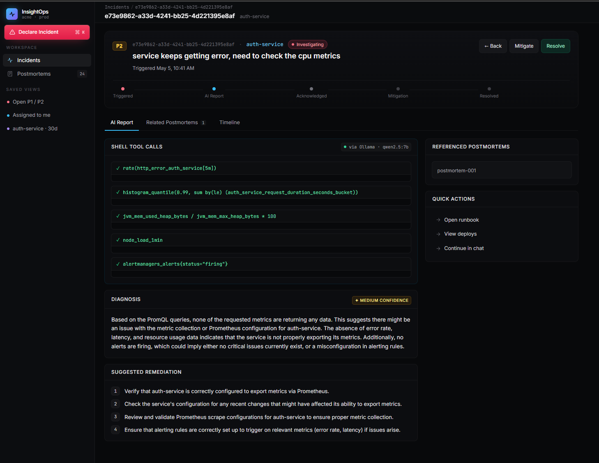
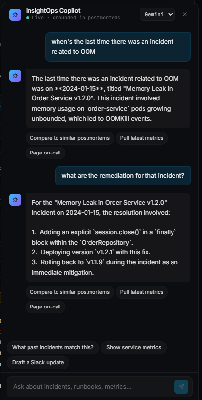
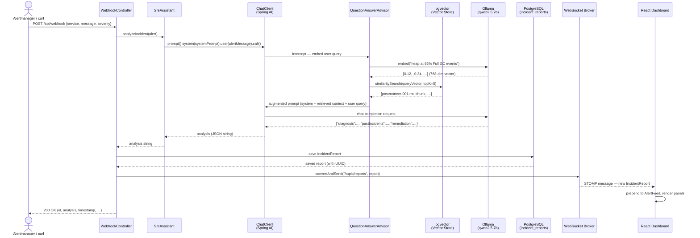
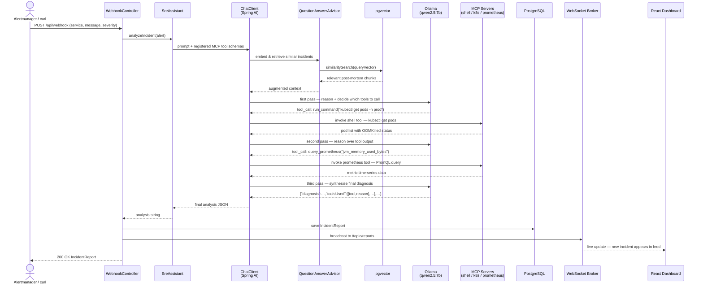
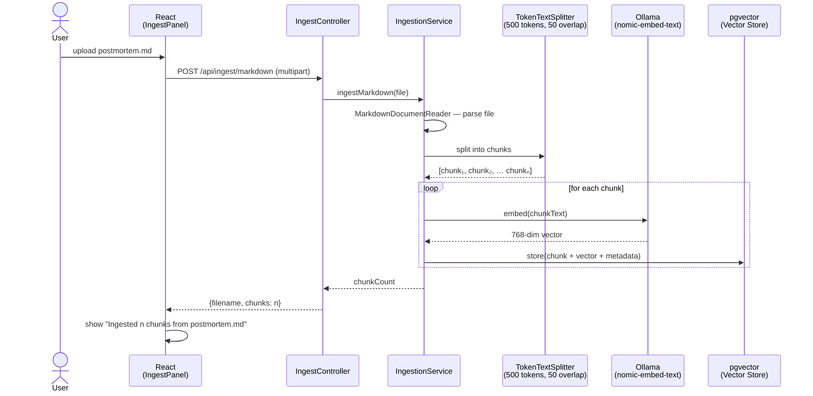

# InsightOps — Intelligent SRE Assistant

InsightOps is an AI-powered Site Reliability Engineering assistant that combines **RAG** (Retrieval-Augmented Generation) with **MCP** (Model Context Protocol) to automatically diagnose production incidents. When an alert fires, it retrieves relevant past post-mortems, optionally queries live system tools, and synthesises an actionable diagnosis with remediation steps — all streamed in real time to a React dashboard.

---
## Preview
### Incident Diagnosis


### SRE Chat Assistant


---

## Table of Contents

- [Architecture](#architecture)
- [How It Works](#how-it-works)
- [Sequence Diagrams](#sequence-diagrams)
- [Project Structure](#project-structure)
- [Prerequisites](#prerequisites)
- [Quick Start](#quick-start)
- [Testing the Full Flow](#testing-the-full-flow)
- [Phase 2 — MCP Tools](#phase-2--mcp-tools-optional)
- [Production Build](#production-build)
- [Environment Variables](#environment-variables)

---

## Architecture

```
┌─────────────────────────────────────────────────────────────────────────┐
│                          InsightOps System                              │
│                                                                         │
│  ┌──────────────────────┐          ┌──────────────────────────────────┐ │
│  │   React Frontend     │          │      Spring Boot Backend         │ │
│  │   (Vite · Tailwind)  │          │      (Java 21 · Port 8080)       │ │
│  │                      │◄─REST───►│                                  │ │
│  │  Dashboard           │          │  ┌────────────────────────────┐  │ │
│  │  AlertFeed           │◄─WS──────┤  │     WebhookController      │  │ │
│  │  IncidentDetail      │          │  │  POST /api/webhook         │  │ │
│  │  ThoughtProcess      │          │  └────────────┬───────────────┘  │ │
│  │  IngestPanel         │          │               │                  │ │
│  └──────────────────────┘          │               ▼                  │ │
│         Port 5173                  │  ┌────────────────────────────┐  │ │
│                                    │  │       SreAssistant         │  │ │
│                                    │  │  (Orchestration Service)   │  │ │
│                                    │  └──────┬──────────┬──────────┘  │ │
│                                    │         │          │             │ │
│                                    │         ▼          ▼             │ │
│                                    │  ┌──────────┐ ┌──────────────┐  │ │
│                                    │  │ChatClient│ │  MCP Clients │  │ │
│                                    │  │(Spring AI│ │ (Phase 2)    │  │ │
│                                    │  │  + RAG   │ │shell/k8s/    │  │ │
│                                    │  │ Advisor) │ │prometheus    │  │ │
│                                    │  └────┬─────┘ └──────┬───────┘  │ │
│                                    │       │              │           │ │
│                                    └───────┼──────────────┼───────────┘ │
│                                            │              │             │
│            ┌───────────────────────────────┼──────────────┼──────────┐  │
│            │          Data Layer           │              │          │  │
│            │                              ▼              ▼          │  │
│            │  ┌─────────────────┐   ┌──────────┐   ┌──────────┐   │  │
│            │  │   PostgreSQL 16  │   │  Ollama  │   │  Shell / │   │  │
│            │  │  ┌───────────┐  │   │(LLM Chat │   │  kubectl │   │  │
│            │  │  │ pgvector  │  │◄──│    +     │   │Prometheus│   │  │
│            │  │  │ extension │  │   │Embeddings│   │  (MCP)   │   │  │
│            │  │  │(vec store)│  │   └──────────┘   └──────────┘   │  │
│            │  │  └───────────┘  │                                  │  │
│            │  │  ┌───────────┐  │                                  │  │
│            │  │  │incident_  │  │                                  │  │
│            │  │  │reports    │  │                                  │  │
│            │  │  │  table    │  │                                  │  │
│            │  │  └───────────┘  │                                  │  │
│            │  └─────────────────┘                                  │  │
│            └──────────────────────────────────────────────────────┘  │
└─────────────────────────────────────────────────────────────────────────┘
```

### Component Responsibilities

| Component | Technology | Role |
|---|---|---|
| **React Frontend** | React 18 + Vite + Tailwind CSS | Real-time incident dashboard; displays AI reasoning, diagnosis, and remediation |
| **WebhookController** | Spring MVC | Entry point for incoming alerts (e.g. Alertmanager, PagerDuty, curl) |
| **IngestController** | Spring MVC | Accepts `.md` and `.pdf` post-mortems for RAG knowledge base |
| **ReportController** | Spring MVC | REST API for querying saved incident reports |
| **SreAssistant** | Spring AI `ChatClient` | Core orchestration: calls the LLM with RAG context + optional MCP tool results |
| **IngestionService** | Spring AI `VectorStore` | Chunks documents and stores embeddings in pgvector |
| **PostmortemSeeder** | Spring `ApplicationRunner` | Auto-seeds the vector store with sample post-mortems on first boot |
| **pgvector** | PostgreSQL 16 extension | Stores document embeddings (768-dim) and performs cosine-similarity search |
| **Ollama** | Local LLM runtime | Serves `qwen2.5:7b` for chat and `nomic-embed-text` for embeddings |
| **MCP Servers** | `npx` subprocesses (Phase 2) | Give the LLM live access to shell, Prometheus, and Kubernetes |

---

## How It Works

InsightOps is built around three core ideas that work together:

### 1. RAG — Retrieval-Augmented Generation

Rather than relying on the LLM's training data alone, InsightOps maintains a **private knowledge base** of your organisation's past post-mortems. When an alert arrives:

1. The alert message is **embedded** (converted to a 768-dimensional vector) using `nomic-embed-text` running in Ollama.
2. A **cosine-similarity search** is performed against the `vector_store` table in PostgreSQL (powered by the pgvector extension) to find the most relevant past incidents.
3. The top matching document chunks are **injected into the LLM's context window** by Spring AI's `QuestionAnswerAdvisor` — so the model reasons over *your specific historical incidents*, not generic knowledge.

This is why the system correctly links "heap at 92%, frequent Full GC" to *Memory Leak in Order Service v1.2.0* even without any explicit rules.

### 2. MCP — Model Context Protocol (Phase 2)

MCP gives the LLM **hands** — the ability to call real tools and read their output before forming a diagnosis. InsightOps acts as an **MCP Host**: it starts lightweight MCP server subprocesses (shell, Prometheus, Kubernetes) via `npx` and registers their tools with the `ChatClient`.

When the LLM decides it needs live data, it emits a tool-call (e.g. `run_command: "df -h"`), Spring AI intercepts it, routes it to the correct MCP server, and feeds the output back to the model for a second reasoning pass. The model then lists every tool it used and why in the `toolsUsed` field of the response.

### 3. Structured JSON Output

The system prompt instructs the LLM to respond exclusively in a JSON envelope:

```json
{
  "diagnosis":     "...",
  "pastIncidents": ["..."],
  "toolsUsed":     [{ "tool": "...", "reason": "..." }],
  "remediation":   ["step 1", "step 2", "..."],
  "confidence":    "high | medium | low"
}
```

The React frontend parses this JSON and renders each field in a dedicated UI panel (`ThoughtProcess`, `IncidentDetail`). If the LLM returns plain text instead of JSON (e.g. during model warm-up), `ThoughtProcess.jsx` falls back to rendering raw text gracefully.

### 4. Real-Time WebSocket Push

When a new `IncidentReport` is saved to PostgreSQL, `WebhookController` immediately broadcasts it to all connected browsers via Spring's STOMP WebSocket broker on `/topic/reports`. The `useWebSocket` hook in the frontend prepends the new report to the feed without requiring a page refresh.

---

## Sequence Diagrams

### Alert Ingestion & Diagnosis (Phase 1 — RAG only)



---

### Alert Ingestion & Diagnosis (Phase 2 — RAG + MCP tools)



---

### Document Ingestion (RAG Knowledge Base)



---

## Project Structure

```
insightops/
├── backend/                               # Spring Boot 3.4 / Java 21
│   ├── build.gradle.kts                   # Gradle build with Spring AI BOM
│   ├── settings.gradle.kts
│   └── src/main/
│       ├── java/com/insightops/
│       │   ├── InsightOpsApplication.java  # Spring Boot entry point
│       │   ├── config/
│       │   │   ├── AiConfig.java          # ChatClient bean with QuestionAnswerAdvisor
│       │   │   ├── McpConfig.java         # MCP client override hooks
│       │   │   ├── WebConfig.java         # CORS for Vite dev server (localhost:5173)
│       │   │   └── WebSocketConfig.java   # STOMP broker on /ws, topic /topic/reports
│       │   ├── controller/
│       │   │   ├── WebhookController.java # POST /api/webhook — alert entry point
│       │   │   ├── IngestController.java  # POST /api/ingest/{markdown|pdf|text}
│       │   │   └── ReportController.java  # GET /api/reports[/{id}]
│       │   ├── model/
│       │   │   ├── Alert.java             # Incoming alert payload (POJO)
│       │   │   └── IncidentReport.java    # JPA entity saved to incident_reports
│       │   ├── repository/
│       │   │   └── IncidentReportRepository.java
│       │   ├── seeder/
│       │   │   └── PostmortemSeeder.java  # Seeds vector store on first boot
│       │   └── service/
│       │       ├── SreAssistant.java      # Core RAG + MCP orchestration
│       │       ├── IngestionService.java  # Chunk → embed → store pipeline
│       │       └── IncidentReportService.java
│       └── resources/
│           ├── application.yml            # All config (DB, Ollama, pgvector, MCP)
│           └── postmortems/               # Seed post-mortems (auto-ingested)
│               ├── postmortem-001.md      # Memory Leak — order-service
│               ├── postmortem-002.md      # Prometheus Scrape Timeout
│               └── postmortem-003.md      # Connection Pool Exhaustion — auth-service
│
├── frontend/                              # React 18 + Vite 5 + Tailwind CSS 3
│   ├── index.html
│   ├── vite.config.js                     # Proxy /api → :8080, /ws → :8080 (WS)
│   ├── tailwind.config.js
│   ├── postcss.config.js
│   └── src/
│       ├── main.jsx                       # ReactDOM.createRoot entry
│       ├── App.jsx
│       ├── index.css                      # Tailwind directives
│       ├── api/
│       │   └── client.js                  # Axios wrapper for all REST calls
│       ├── hooks/
│       │   ├── useWebSocket.js            # STOMP/SockJS subscription hook
│       │   └── useReports.js              # Fetch + live WebSocket merge
│       └── components/
│           ├── Dashboard.jsx              # Root layout — header + panels
│           ├── AlertFeed.jsx              # Scrollable list of incident cards
│           ├── IncidentDetail.jsx         # Full report view (all panels)
│           ├── ThoughtProcess.jsx         # Parses toolsUsed + pastIncidents JSON
│           ├── IngestPanel.jsx            # File upload UI → /api/ingest
│           └── SeverityBadge.jsx          # P1/P2/P3/P4 colour-coded pill
│
├── docker-compose.yml                     # pgvector/pgvector:pg16
├── .gitignore
└── README.md
```

---

## Prerequisites

| Tool | Version | Notes |
|---|---|---|
| Java | 21+ | Temurin / OpenJDK |
| Gradle | 8.x | Only needed once to bootstrap the wrapper |
| Docker + Compose | any recent | Runs pgvector |
| Node.js | 18+ | Frontend build + optional MCP servers |
| Ollama | any | Serves the LLM and embedding model locally |

> **LLM / Embedding models required in Ollama:**
> ```bash
> ollama pull qwen2.5:7b      # chat model (~5.2 GB)
> ollama pull nomic-embed-text    # embedding model (~274 MB)
> ```

---

## Quick Start

### 1 — Start Ollama

Make sure the Ollama desktop app is running (or run `ollama serve`).

### 2 — Start PostgreSQL with pgvector

```bash
docker compose up -d
```

### 3 — Generate the Gradle wrapper (first time only)

```bash
cd backend
gradle wrapper
```

### 4 — Start the backend

```bash
cd backend
./gradlew bootRun
```

On first boot, `PostmortemSeeder` automatically embeds and stores the three sample post-mortems into pgvector. You will see:

```
Seeded postmortem: postmortem-001.md
Seeded postmortem: postmortem-002.md
Seeded postmortem: postmortem-003.md
```

### 5 — Start the frontend

```bash
cd frontend
npm install
npm run dev
```

Open **http://localhost:5173**

---

## Testing the Full Flow

```bash
curl -X POST http://localhost:8080/api/webhook \
  -H "Content-Type: application/json" \
  -d '{
    "service": "order-service",
    "message": "Memory usage spiking on order-service, heap at 92%, frequent Full GC events",
    "severity": "P1",
    "timestamp": "2025-06-01T10:00:00Z"
  }'
```

**Expected behaviour:**
1. RAG retrieves `postmortem-001.md` (memory leak in order-service) via cosine similarity.
2. `SreAssistant` calls Ollama with the retrieved context and alert message.
3. Response JSON contains `diagnosis`, `pastIncidents`, `toolsUsed`, `remediation`, `confidence`.
4. React dashboard receives the report via WebSocket and it appears instantly in the feed.
5. Clicking the report opens the full view with Thought Process, Diagnosis, and Remediation panels.

### Ingest a custom post-mortem

Via the **Ingest Post-Mortem** panel in the UI (supports `.md` and `.pdf`), or via API:

```bash
curl -X POST http://localhost:8080/api/ingest/text \
  -H "Content-Type: application/json" \
  -d '{"content": "# Incident: Redis OOM\n## Root Cause\nMaxmemory policy set to noeviction...", "source": "redis-oom-2025"}'
```

---

## Phase 2 — MCP Tools (optional)

MCP gives the LLM access to live system state. Enable it by editing `backend/src/main/resources/application.yml`:

```yaml
spring:
  ai:
    mcp:
      client:
        enabled: true
        clients:
          shell:
            transport:
              type: stdio
              command: "npx"
              args: ["-y", "@modelcontextprotocol/server-shell"]
          # prometheus:
          #   transport:
          #     type: stdio
          #     command: "npx"
          #     args: ["-y", "@modelcontextprotocol/server-prometheus"]
          #     env:
          #       PROMETHEUS_URL: "http://localhost:9090"
          # kubernetes:
          #   transport:
          #     type: stdio
          #     command: "npx"
          #     args: ["-y", "@modelcontextprotocol/server-kubernetes"]
```

> **Start with only `shell` first.** Confirm it works (look for tool invocations in the `toolsUsed` field), then enable Prometheus and Kubernetes one at a time.

Requires Node.js and `npx`. Restart the backend after changing the config.

---

## Production Build

Bundle the React app into the Spring Boot jar so a single `java -jar` serves everything:

```bash
# Option A — manual
cd frontend && npm run build
cp -r dist/* ../backend/src/main/resources/static/
cd ../backend && ./gradlew bootJar
java -jar build/libs/insightops-backend-0.0.1-SNAPSHOT.jar

# Option B — Gradle does it all
cd backend
./gradlew copyFrontend bootJar
```

In production, CORS is no longer needed because the React app is served from the same origin as the API.

---

## Environment Variables

| Variable | Required | Default | Description |
|---|---|---|---|
| `SPRING_DATASOURCE_URL` | No | `jdbc:postgresql://localhost:5432/insightops` | PostgreSQL connection URL |
| `SPRING_DATASOURCE_USERNAME` | No | `postgres` | DB username |
| `SPRING_DATASOURCE_PASSWORD` | No | `postgres` | DB password |
| `PROMETHEUS_URL` | Phase 2 | `http://localhost:9090` | Prometheus base URL for MCP server |

> **No API key required** — InsightOps runs entirely on local Ollama models.
