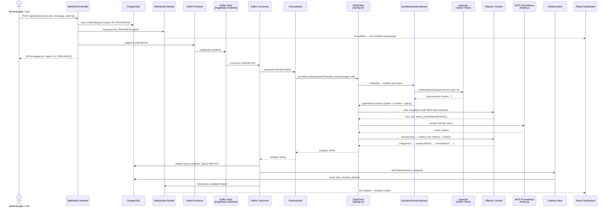
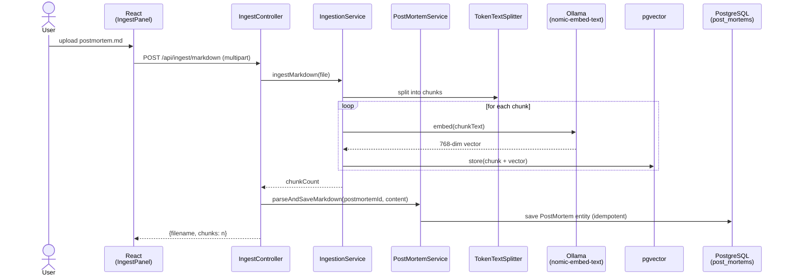
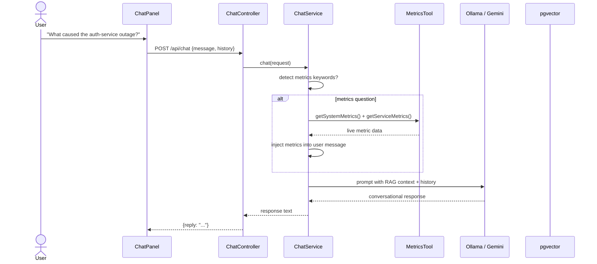

# InsightOps — Intelligent SRE Assistant

InsightOps is an AI-powered Site Reliability Engineering assistant that combines **RAG** (Retrieval-Augmented Generation) with **MCP** (Model Context Protocol) to automatically diagnose production incidents. When an alert fires, it retrieves relevant past post-mortems, optionally queries live Prometheus metrics, and synthesises an actionable diagnosis with remediation steps — all streamed in real time to a React dashboard. A built-in **SRE Chat** panel lets engineers ask follow-up questions using conversational AI with live system context.

---
## Preview
### Incident Diagnosis


### SRE Chat Assistant


---

## Table of Contents

- [Architecture](#architecture)
- [How It Works](#how-it-works)
- [Sequence Diagrams](#sequence-diagrams)
- [Project Structure](#project-structure)
- [Prerequisites](#prerequisites)
- [Quick Start](#quick-start)
- [Testing the Full Flow](#testing-the-full-flow)
- [MCP Tools — Live Prometheus Metrics](#mcp-tools--live-prometheus-metrics)
- [LLM Provider Switching](#llm-provider-switching)
- [Post Mortem Management](#post-mortem-management)
- [Production Build](#production-build)
- [Environment Variables](#environment-variables)

---

## Architecture

```
┌──────────────────────────────────────────────────────────────────────────────────┐
│                              InsightOps System                                   │
│                                                                                  │
│  ┌──────────────────────────┐          ┌───────────────────────────────────────┐  │
│  │   React Frontend         │          │       Spring Boot Backend             │  │
│  │   (Vite · Tailwind · RR) │          │       (Java 21 · Port 8080)          │  │
│  │                          │◄─REST───►│                                       │  │
│  │  Sidebar                 │          │  ┌─────────────────────────────────┐  │  │
│  │  Dashboard / IncidentFeed│◄─WS──────┤  │      WebhookController          │  │  │
│  │  IncidentDetailPage      │          │  │  POST /api/webhook              │  │  │
│  │  PostMortemList          │          │  └──────────────┬──────────────────┘  │  │
│  │  PostMortemDetail        │          │                 │                     │  │
│  │  ChatPanel               │          │                 ▼                     │  │
│  │  DeclareIncidentModal    │          │  ┌──────────────────────────────┐     │  │
│  └──────────────────────────┘          │  │      IncidentProducer       │     │  │
│         Port 5173                      │  │  (Kafka — async handoff)    │     │  │
│                                        │  └──────────────┬─────────────┘     │  │
│                                        │                 │                    │  │
│                                        │                 ▼                    │  │
│                                        │  ┌──────────────────────────────┐    │  │
│                                        │  │    IncidentConsumer          │    │  │
│                                        │  │  (Kafka listener)           │    │  │
│                                        │  └──────────┬─────────────────┘    │  │
│                                        │             │                      │  │
│                                        │             ▼                      │  │
│                                        │  ┌──────────────────────────────┐   │  │
│                                        │  │      SreAssistant            │   │  │
│                                        │  │  (RAG + MCP orchestration)   │   │  │
│                                        │  └──────┬──────────┬────────────┘   │  │
│                                        │         │          │                │  │
│                                        │         ▼          ▼                │  │
│                                        │  ┌──────────┐ ┌──────────────────┐  │  │
│                                        │  │ChatClient│ │  MCP Client      │  │  │
│                                        │  │(Spring AI│ │ (Prometheus      │  │  │
│                                        │  │  + RAG   │ │  via custom      │  │  │
│                                        │  │ Advisor) │ │  Node.js server) │  │  │
│                                        │  └────┬─────┘ └──────┬───────────┘  │  │
│                                        │       │              │              │  │
│                                        └───────┼──────────────┼──────────────┘  │
│                                                │              │                 │
│            ┌───────────────────────────────────┼──────────────┼───────────────┐  │
│            │          Data / Infra Layer       │              │               │  │
│            │                                   ▼              ▼               │  │
│            │  ┌─────────────────┐   ┌──────────┐   ┌──────────────────┐      │  │
│            │  │   PostgreSQL 16  │   │  Ollama  │   │  Prometheus      │      │  │
│            │  │  ┌───────────┐  │   │  / Gemini│   │  + Grafana       │      │  │
│            │  │  │ pgvector  │  │◄──│(LLM Chat │   │  (metrics)       │      │  │
│            │  │  │(vec store)│  │   │    +     │   └──────────────────┘      │  │
│            │  │  └───────────┘  │   │Embeddings│                             │  │
│            │  │  ┌───────────┐  │   └──────────┘   ┌──────────────────┐      │  │
│            │  │  │incident_  │  │                   │     Kafka        │      │  │
│            │  │  │reports    │  │                   │  (KRaft mode)    │      │  │
│            │  │  └───────────┘  │                   │  insightops.     │      │  │
│            │  │  ┌───────────┐  │                   │  incidents topic │      │  │
│            │  │  │post_      │  │                   └──────────────────┘      │  │
│            │  │  │mortems    │  │                                             │  │
│            │  │  └───────────┘  │                                             │  │
│            │  │  ┌───────────┐  │                                             │  │
│            │  │  │post_mortem│  │                                             │  │
│            │  │  │_citations │  │                                             │  │
│            │  │  └───────────┘  │                                             │  │
│            │  └─────────────────┘                                             │  │
│            └─────────────────────────────────────────────────────────────────┘  │
└──────────────────────────────────────────────────────────────────────────────────┘
```

### Component Responsibilities

| Component | Technology | Role |
|---|---|---|
| **React Frontend** | React 18 + Vite + Tailwind + React Router | Incident dashboard with sidebar navigation, post mortem browser, and SRE chat |
| **Sidebar** | React Router `<Link>` | Persistent navigation: Incidents, Postmortems, Declare Incident (⌘K) |
| **ChatPanel** | Axios + Spring AI | Conversational SRE assistant with history, live metrics injection, and LLM provider toggle |
| **WebhookController** | Spring MVC | Entry point for incoming alerts; saves report as `IN_PROGRESS`, publishes to Kafka |
| **IncidentProducer / Consumer** | Spring Kafka | Async analysis pipeline — webhook returns immediately, analysis happens in background |
| **IngestController** | Spring MVC | Accepts `.md`, `.pdf`, and text post-mortems; stores in both vector store and `post_mortems` table |
| **ReportController** | Spring MVC | REST API for querying saved incident reports |
| **PostMortemController** | Spring MVC | REST API for post mortems — list, get by ID/ref, get by incident |
| **ChatController** | Spring MVC | POST `/api/chat` — conversational AI with RAG context and live metrics |
| **LlmSettingsController** | Spring MVC | GET/POST `/api/settings/llm` — switch between Ollama and Gemini at runtime |
| **SreAssistant** | Spring AI `ChatClient` | Core orchestration: calls the LLM with RAG context + optional MCP Prometheus tools |
| **LlmProviderService** | Spring AI | Manages active LLM provider (Ollama / Gemini), builds ChatClient with RAG advisor |
| **ChatService** | Spring AI | Conversational chat with history, auto-detects metrics questions and injects live data |
| **MetricsTool** | JMX + static data | Provides live JVM metrics and simulated service/incident metrics for chat context |
| **PostMortemService** | Spring Data JPA | CRUD for post mortems, markdown parsing, idempotent import |
| **PostMortemCitationLinker** | Jackson + JPA | Parses `pastIncidents` from LLM JSON response and creates citation links in the join table |
| **PostMortemImporter** | Spring `ApplicationRunner` | Auto-imports markdown post-mortems from `resources/postmortems/` into Postgres on startup |
| **PostmortemSeeder** | Spring `ApplicationRunner` | Seeds the vector store with post-mortem embeddings for RAG retrieval |
| **IngestionService** | Spring AI `VectorStore` | Chunks documents and stores embeddings in pgvector |
| **pgvector** | PostgreSQL 16 extension | Stores document embeddings (768-dim) and performs cosine-similarity search |
| **Ollama** | Local LLM runtime | Serves `qwen2.5:7b` for chat and `nomic-embed-text` for embeddings |
| **Gemini** | Google AI (optional) | Alternative LLM via OpenAI-compatible endpoint — switchable at runtime |
| **Kafka** | Confluent (KRaft mode) | Decouples alert ingestion from LLM analysis for non-blocking webhook responses |
| **Prometheus + Grafana** | Monitoring stack | Collects Spring Boot Actuator metrics; Prometheus queried via MCP for live diagnosis |
| **MCP Prometheus Server** | Custom Node.js | Exposes Prometheus PromQL as MCP tools the LLM can invoke during analysis |

---

## How It Works

InsightOps is built around five core ideas that work together:

### 1. RAG — Retrieval-Augmented Generation

Rather than relying on the LLM's training data alone, InsightOps maintains a **private knowledge base** of your organisation's past post-mortems. When an alert arrives:

1. The alert message is **embedded** (converted to a 768-dimensional vector) using `nomic-embed-text` running in Ollama.
2. A **cosine-similarity search** is performed against the `vector_store` table in PostgreSQL (powered by the pgvector extension) to find the most relevant past incidents.
3. The top matching document chunks are **injected into the LLM's context window** by Spring AI's `QuestionAnswerAdvisor` — so the model reasons over *your specific historical incidents*, not generic knowledge.

This is why the system correctly links "heap at 92%, frequent Full GC" to *Memory Leak in Order Service v1.2.0* even without any explicit rules.

### 2. Async Analysis via Kafka

Alert processing is **non-blocking**. When a webhook arrives:

1. `WebhookController` saves the `IncidentReport` with status `IN_PROGRESS` and returns `202 Accepted` immediately.
2. An `IncidentEvent` is published to the `insightops.incidents` Kafka topic.
3. `IncidentConsumer` picks up the event, runs `SreAssistant.analyzeIncident()`, and updates the report with the analysis and status `READY`.
4. The completed report is broadcast via WebSocket — the dashboard updates in real time.

This means the caller (Alertmanager, PagerDuty, curl) never waits for the LLM.

### 3. MCP — Model Context Protocol

MCP gives the LLM **hands** — the ability to query live Prometheus metrics before forming a diagnosis. A custom Node.js MCP server (`mcp-prometheus/server.js`) exposes PromQL as tool calls. When the LLM decides it needs live data, it emits a tool-call, Spring AI intercepts it, routes it to the MCP server, and feeds the output back for a second reasoning pass. The model then lists every tool it used in the `toolsUsed` field.

### 4. Post Mortem Database & Citations

Post mortems are stored in a dedicated `post_mortems` Postgres table (alongside the vector store used for RAG). When the LLM cites past incidents in its `pastIncidents` JSON array, `PostMortemCitationLinker` automatically creates rows in the `post_mortem_citations` join table, linking the incident report to the referenced post mortems. The frontend renders these as clickable links in the incident detail view.

### 5. Structured JSON Output + Real-Time Push

The system prompt instructs the LLM to respond exclusively in a JSON envelope:

```json
{
  "diagnosis":     "...",
  "pastIncidents": ["..."],
  "toolsUsed":     [{ "tool": "...", "output": "..." }],
  "remediation":   ["step 1", "step 2", "..."],
  "confidence":    "high | medium | low"
}
```

The React frontend parses this JSON and renders each field in dedicated UI panels. When a new `IncidentReport` is saved or updated, it is broadcast via Spring's STOMP WebSocket broker on `/topic/reports`. The `useWebSocket` hook in the frontend updates the feed instantly without a page refresh.

---

## Sequence Diagrams

### Alert Ingestion & Diagnosis (Async via Kafka)



---

### Document Ingestion (RAG Knowledge Base + Post Mortem Storage)



---

### SRE Chat (Conversational AI)



---

## Project Structure

```
insightops/
├── backend/                               # Spring Boot 3.4 / Java 21
│   ├── build.gradle.kts                   # Gradle build with Spring AI BOM + Kafka
│   ├── settings.gradle.kts
│   └── src/main/
│       ├── java/com/insightops/
│       │   ├── InsightOpsApplication.java
│       │   ├── config/
│       │   │   ├── AiConfig.java          # ChatClient bean with QuestionAnswerAdvisor
│       │   │   ├── KafkaTopicConfig.java  # insightops.incidents topic definition
│       │   │   ├── McpConfig.java         # Prometheus MCP client (Node.js stdio)
│       │   │   ├── WebConfig.java         # CORS for Vite dev server
│       │   │   └── WebSocketConfig.java   # STOMP broker on /ws
│       │   ├── controller/
│       │   │   ├── WebhookController.java # POST /api/webhook — saves + publishes to Kafka
│       │   │   ├── IngestController.java  # POST /api/ingest/{markdown|pdf|text}
│       │   │   ├── ReportController.java  # GET /api/reports[/{id}]
│       │   │   ├── PostMortemController.java # GET /api/postmortems[/{id}|/ref/{ref}]
│       │   │   ├── ChatController.java    # POST /api/chat — conversational SRE assistant
│       │   │   └── LlmSettingsController.java # GET/POST /api/settings/llm
│       │   ├── dto/
│       │   │   ├── PostMortemDTO.java
│       │   │   ├── ChatRequest.java / ChatResponse.java / ChatMessage.java
│       │   │   └── LlmSettingsRequest.java / LlmSettingsResponse.java
│       │   ├── event/
│       │   │   └── IncidentEvent.java     # Kafka event record
│       │   ├── kafka/
│       │   │   ├── IncidentProducer.java   # Publishes to insightops.incidents
│       │   │   └── IncidentConsumer.java   # Consumes, runs analysis, links citations
│       │   ├── model/
│       │   │   ├── Incident.java          # Incoming incident payload (POJO)
│       │   │   ├── IncidentReport.java    # JPA entity — incident_reports table
│       │   │   ├── PostMortem.java        # JPA entity — post_mortems table
│       │   │   ├── PostMortemCitation.java # JPA entity — post_mortem_citations join table
│       │   │   ├── PostMortemCitationId.java # Composite key for citations
│       │   │   └── LlmProvider.java       # Enum: OLLAMA, GEMINI
│       │   ├── repository/
│       │   │   ├── IncidentReportRepository.java
│       │   │   ├── PostMortemRepository.java
│       │   │   └── PostMortemCitationRepository.java
│       │   ├── seeder/
│       │   │   ├── PostMortemImporter.java # Imports postmortem .md files → post_mortems table
│       │   │   └── PostmortemSeeder.java   # Seeds vector store with embeddings for RAG
│       │   └── service/
│       │       ├── SreAssistant.java       # Core RAG + MCP orchestration
│       │       ├── LlmProviderService.java # Manages Ollama/Gemini switching
│       │       ├── ChatService.java        # Conversational AI with metrics injection
│       │       ├── MetricsTool.java        # JVM + service + incident metrics
│       │       ├── IngestionService.java   # Chunk → embed → store pipeline
│       │       ├── IncidentReportService.java # Persistence + WebSocket broadcast
│       │       ├── PostMortemService.java  # CRUD + markdown parsing + import
│       │       └── PostMortemCitationLinker.java # Links pastIncidents → post_mortem_citations
│       └── resources/
│           ├── application.yml            # All config (DB, Ollama, Gemini, Kafka, MCP)
│           └── postmortems/               # 23 seed post-mortems (auto-imported)
│               ├── postmortem-001.md      # Memory Leak — order-service
│               ├── postmortem-002.md      # Prometheus Scrape Timeout
│               ├── postmortem-003.md      # Connection Pool Exhaustion — auth-service
│               └── postmortem-004…023.md  # DNS, Kafka, TLS, Redis, disk, timeouts, etc.
│
├── frontend/                              # React 18 + Vite 5 + Tailwind CSS 3
│   ├── index.html
│   ├── vite.config.js                     # Proxy /api → :8080, /ws → :8080
│   ├── tailwind.config.js
│   ├── postcss.config.js
│   └── src/
│       ├── main.jsx                       # ReactDOM.createRoot entry
│       ├── App.jsx                        # BrowserRouter + AppShell + Routes
│       ├── index.css                      # Tailwind directives
│       ├── api/
│       │   ├── client.js                  # Axios REST client (reports, postmortems, ingest)
│       │   ├── chat.js                    # Chat API client
│       │   └── settings.js               # LLM settings API client
│       ├── hooks/
│       │   ├── useWebSocket.js            # STOMP/SockJS subscription hook
│       │   └── useReports.js              # Fetch + live WebSocket merge
│       ├── pages/
│       │   ├── IncidentDetailPage.jsx     # Full incident report view (routed)
│       │   ├── PostMortemList.jsx          # Browse all post mortems
│       │   └── PostMortemDetail.jsx        # Single post mortem detail view
│       └── components/
│           ├── Sidebar.jsx                # Persistent nav: Incidents, Postmortems, Declare
│           ├── Dashboard.jsx              # Home — incident feed + declare modal
│           ├── IncidentFeed.jsx           # Scrollable list of incident cards
│           ├── IncidentDetail.jsx         # Full report panels + post mortem citation links
│           ├── ChatPanel.jsx              # Collapsible SRE chat with LLM provider toggle
│           ├── DeclareIncidentModal.jsx   # ⌘K modal for declaring new incidents
│           ├── ThoughtProcess.jsx         # Renders toolsUsed + pastIncidents JSON
│           ├── IngestPanel.jsx            # File upload UI → /api/ingest
│           ├── PostMortemCard.jsx          # Reusable post mortem summary card
│           ├── SeverityBadge.jsx          # P1/P2/P3/P4 colour-coded pill
│           ├── StatusPill.jsx             # IN_PROGRESS / READY / FAILED status badge
│           ├── ConfidenceTag.jsx          # high / medium / low confidence badge
│           ├── TopBar.jsx                 # Page header bar
│           └── Avatar.jsx                 # User avatar component
│
├── mcp-prometheus/                        # Custom MCP server for Prometheus
│   ├── server.js                          # Node.js MCP server — PromQL tool
│   └── package.json
│
├── docker-compose.yml                     # PostgreSQL (pgvector), Kafka, Prometheus, Grafana
├── prometheus.yml                         # Prometheus scrape config
├── .gitignore
└── README.md
```

---

## Prerequisites

| Tool | Version | Notes |
|---|---|---|
| Java | 21+ | Temurin / OpenJDK |
| Gradle | 8.x | Only needed once to bootstrap the wrapper |
| Docker + Compose | any recent | Runs PostgreSQL, Kafka, Prometheus, Grafana |
| Node.js | 18+ | Frontend build + MCP Prometheus server |
| Ollama | any | Serves the LLM and embedding model locally |

> **LLM / Embedding models required in Ollama:**
> ```bash
> ollama pull qwen2.5:7b         # chat model (~5.2 GB)
> ollama pull nomic-embed-text   # embedding model (~274 MB)
> ```

---

## Quick Start

### 1 — Start Ollama

Make sure the Ollama desktop app is running (or run `ollama serve`).

### 2 — Start infrastructure (PostgreSQL, Kafka, Prometheus, Grafana)

```bash
docker compose up -d
```

### 3 — Generate the Gradle wrapper (first time only)

```bash
cd backend
gradle wrapper
```

### 4 — Start the backend

```bash
cd backend
./gradlew bootRun
```

On first boot:
- `PostMortemImporter` imports all 23 post-mortem markdown files into the `post_mortems` table
- `PostmortemSeeder` embeds and stores them into pgvector for RAG retrieval

```
Imported postmortem: postmortem-001
Imported postmortem: postmortem-002
...
Seeded postmortem: postmortem-001.md
Seeded postmortem: postmortem-002.md
...
```

### 5 — Start the frontend

```bash
cd frontend
npm install
npm run dev
```

Open **http://localhost:5173**

---

## Testing the Full Flow

### Declare an incident via the UI

Press **⌘K** (or click "Declare Incident" in the sidebar) to open the incident declaration modal. Select a service, severity, and describe the issue.

### Declare via API

```bash
curl -X POST http://localhost:8080/api/webhook \
  -H "Content-Type: application/json" \
  -d '{
    "service": "order-service",
    "message": "Memory usage spiking on order-service, heap at 92%, frequent Full GC events",
    "severity": "P1",
    "timestamp": "2025-06-01T10:00:00Z"
  }'
```

**Expected behaviour:**
1. Webhook returns `202 Accepted` immediately with `status: IN_PROGRESS`.
2. The incident appears in the dashboard with an "Analyzing" status pill.
3. Kafka consumer picks up the event and runs AI analysis (RAG retrieval + optional Prometheus queries).
4. Once complete, the report updates to "Investigating" with full diagnosis, remediation, and post mortem citation links.
5. Clicking a cited post mortem navigates to its detail page.

### Browse post mortems

Navigate to `/postmortems` (or click "Postmortems" in the sidebar) to view all imported post mortems.

### Ingest a custom post-mortem

Via the **Ingest Post-Mortem** panel in the UI (supports `.md` and `.pdf`), or via API:

```bash
curl -X POST http://localhost:8080/api/ingest/text \
  -H "Content-Type: application/json" \
  -d '{"content": "# Incident: Redis OOM\nDate: 2025-01-10 | Severity: P1 | Service: cache-service\n\n## Summary\nRedis OOM kill.\n\n## Root Cause\nMaxmemory policy set to noeviction...", "source": "redis-oom-2025"}'
```

Ingested documents are stored in both the vector store (for RAG) and the `post_mortems` table (for browsing).

### Use the SRE Chat

Click the chat panel on the right side of the dashboard to ask follow-up questions:
- *"What caused the last auth-service outage?"*
- *"Show me current CPU metrics"*
- *"What should I check when HikariCP connections are exhausted?"*

The chat auto-detects metrics-related questions and injects live system data into the context.

---

## MCP Tools — Live Prometheus Metrics

InsightOps includes a custom MCP server (`mcp-prometheus/server.js`) that exposes Prometheus PromQL as tools the LLM can invoke during analysis. The MCP client is configured in `McpConfig.java` and connects via stdio to the Node.js process.

When enabled, the LLM can:
- Query error rates for specific services
- Check p99 latency
- Read JVM heap and CPU metrics
- Check firing Prometheus alerts

The MCP client starts automatically if Node.js is available. Check backend logs for `[MCP] Prometheus client initialized` to confirm.

**Prometheus** is available at http://localhost:9090 and **Grafana** at http://localhost:3000 (admin/admin).

---

## LLM Provider Switching

InsightOps supports two LLM providers, switchable at runtime without restart:

| Provider | Config | Notes |
|---|---|---|
| **Ollama** (default) | Local, no API key | `qwen2.5:7b` for chat, `nomic-embed-text` for embeddings |
| **Gemini** | Requires `GEMINI_API_KEY` env var | Uses Google's OpenAI-compatible endpoint (`gemini-2.5-flash`) |

Switch providers via the toggle in the ChatPanel or via API:

```bash
# Check current provider
curl http://localhost:8080/api/settings/llm

# Switch to Gemini
curl -X POST http://localhost:8080/api/settings/llm \
  -H "Content-Type: application/json" \
  -d '{"provider": "GEMINI"}'
```

To enable Gemini, set the API key in a `.env` file at the project root:
```
GEMINI_API_KEY=your-key-here
```

> **Embeddings always use Ollama** (`nomic-embed-text`) regardless of the active chat provider.

---

## Post Mortem Management

Post mortems are stored in two places for different purposes:

| Storage | Purpose |
|---|---|
| `post_mortems` table (PostgreSQL) | Structured data for browsing, detail pages, and citation linking |
| `vector_store` table (pgvector) | Embeddings for RAG retrieval during incident analysis |

### Database Schema

- **`post_mortems`** — `id`, `postmortemId`, `title`, `incidentDate`, `severity`, `service`, `summary`, `rootCause`, `detection`, `resolution`, `indicators`, timestamps
- **`post_mortem_citations`** — join table (`incident_report_id`, `post_mortem_id`) — many-to-many relationship between incidents and cited post mortems
- **`incident_reports`** — `id`, `service`, `severity`, `message`, `analysis`, `status`, `timestamp`

### API Endpoints

| Method | Endpoint | Description |
|---|---|---|
| `GET` | `/api/postmortems` | List all post mortems |
| `GET` | `/api/postmortems/{id}` | Get by UUID |
| `GET` | `/api/postmortems/ref/{postmortemId}` | Get by reference ID (e.g. `postmortem-001`) |
| `GET` | `/api/incidents/{id}/postmortems` | Get post mortems cited by an incident |

---

## Production Build

Bundle the React app into the Spring Boot jar so a single `java -jar` serves everything:

```bash
# Option A — manual
cd frontend && npm run build
cp -r dist/* ../backend/src/main/resources/static/
cd ../backend && ./gradlew bootJar
java -jar build/libs/insightops-backend-0.0.1-SNAPSHOT.jar

# Option B — Gradle does it all
cd backend
./gradlew copyFrontend bootJar
```

In production, CORS is no longer needed because the React app is served from the same origin as the API.

---

## Environment Variables

| Variable | Required | Default | Description |
|---|---|---|---|
| `SPRING_DATASOURCE_URL` | No | `jdbc:postgresql://localhost:5432/insightops` | PostgreSQL connection URL |
| `SPRING_DATASOURCE_USERNAME` | No | `postgres` | DB username |
| `SPRING_DATASOURCE_PASSWORD` | No | `postgres` | DB password |
| `SPRING_KAFKA_BOOTSTRAP_SERVERS` | No | `localhost:9092` | Kafka broker address |
| `GEMINI_API_KEY` | For Gemini | `placeholder` | Google Gemini API key (enables Gemini provider) |
| `PROMETHEUS_URL` | For MCP | `http://localhost:9090` | Prometheus base URL for MCP server |
| `LLM_DEFAULT_PROVIDER` | No | `OLLAMA` | Default LLM provider on startup (`OLLAMA` or `GEMINI`) |

> **No API key required for default setup** — InsightOps runs entirely on local Ollama models.
